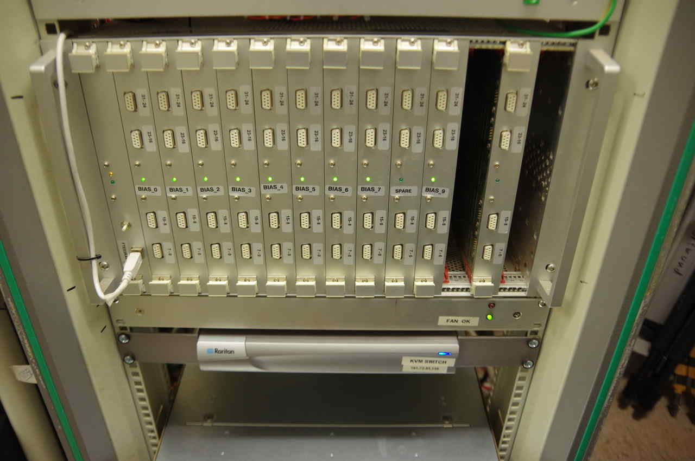
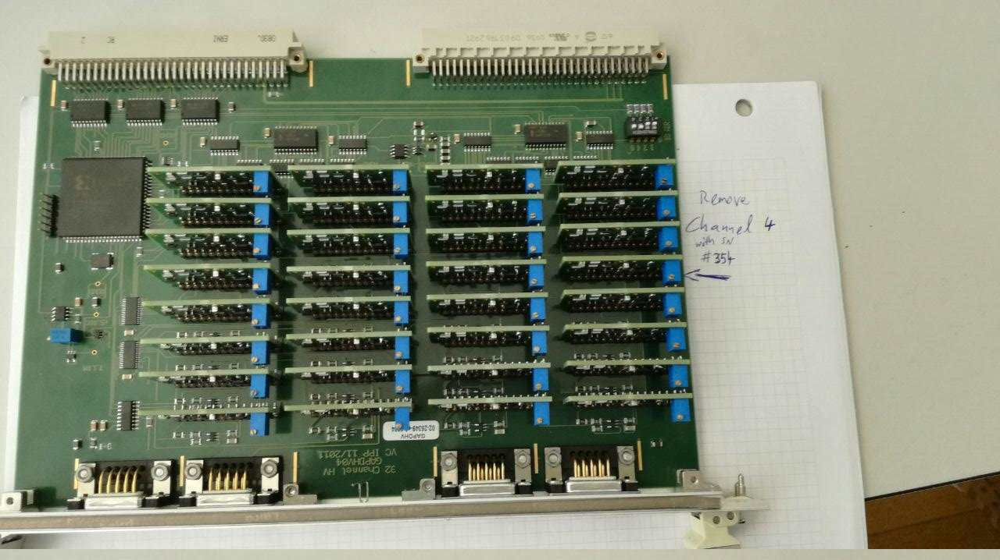
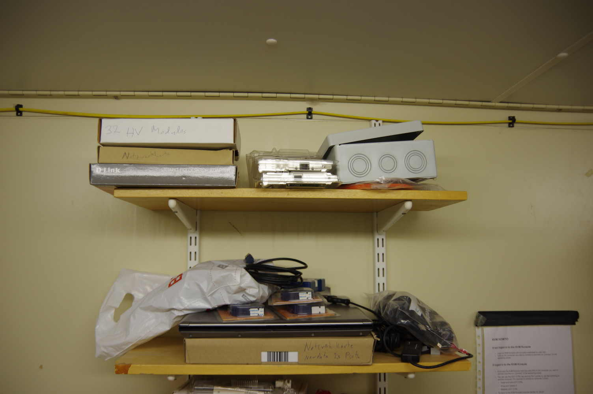
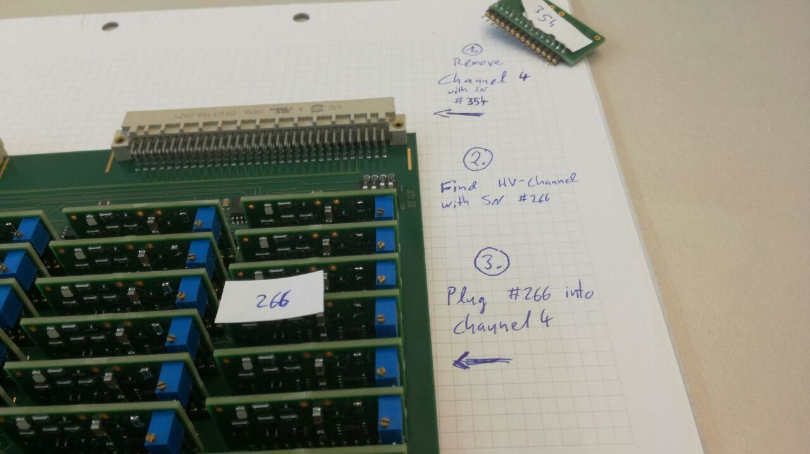
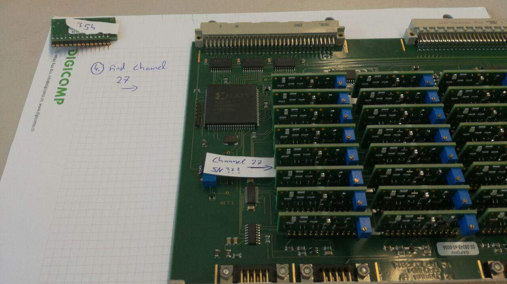
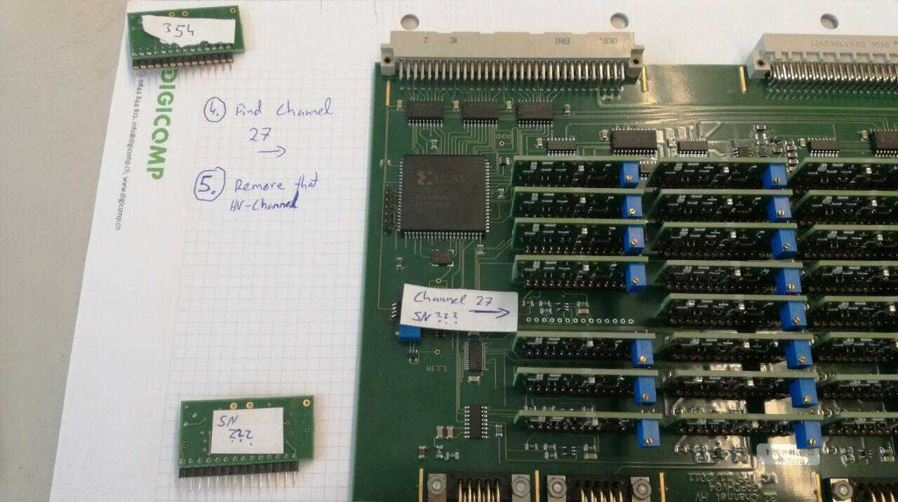
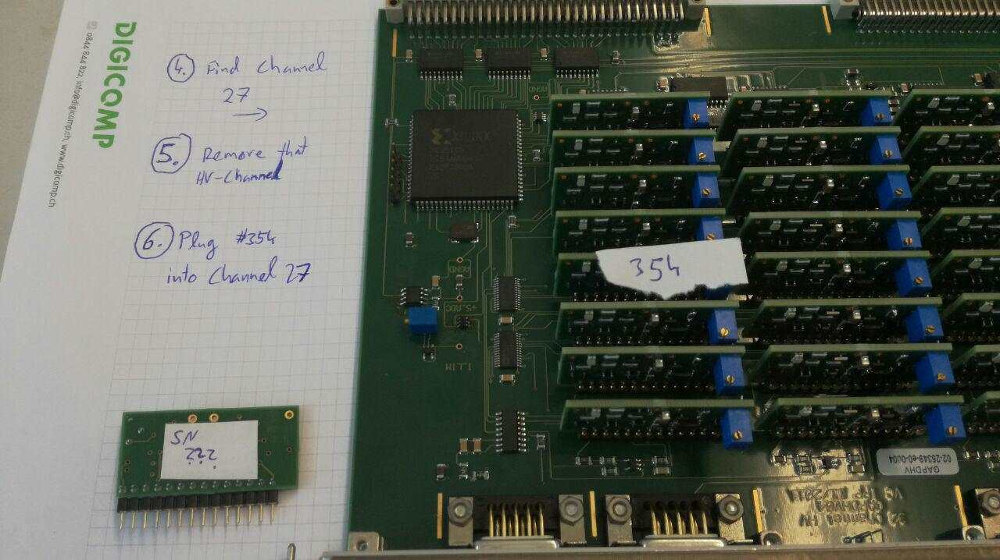
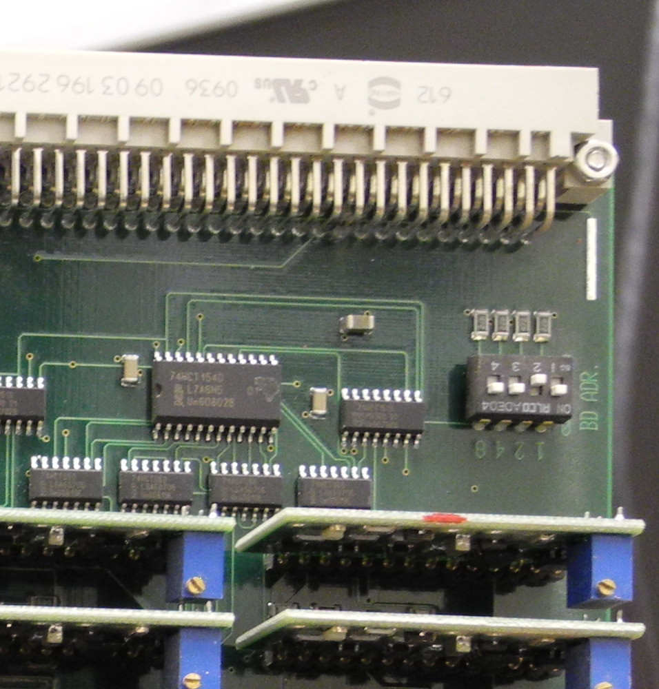

# Bias crate intervention 10.05.2017

On 02.04.2017 FACT had a problem with the bias crate. An attempt to repair it
immediately in that night went unfortunately wrong.

This document tries to describe how to revert the "wrong repair" and possibly
perform the "right" repair in a couple of steps.

## Preparations

 * Switch off the bias crate and
 * Switch off the 80V Agilent Power supply and
 * remove the Bias "Motherboard" labeled `BIAS_2`

\newpage

## Swap HV-channel-board in Channel 4 (#354 -> #266)

### Step 1: Remove HV-Channel 4

Lay the board flat in front of you as shown in the image:

Remove the little HV-Channel-board in channel number 4. The channel is indicated by
an arrow on the paper. The little HV-Channel-board should have the number "#354"
on its backside written with magic marker.

**Note:** Take care not to change the little blue potis setting, i.e. take care not to touch the little screw on top.

\newpage

### Step 2: Find little HV-Channel-board #266

 * Find the box labeled "32 HV Modules" on the upper left shelf near the window, see also the image below:

 * Find the HV-channel labeled "#266" within that box. It is labeled "broken", but this might have been a mistake, #266 might in fact be working fine.

\newpage

### Step 3: Insert the little HV-Channel-board #266 into channel 4 of the motherboard.

### Step 4:

 * Insert the Motherboard `BIAS_2` again back into the crate and switch it on.
 * Switch on the 80V Agilent power supply and
 * observe if it goes immediately into its over current protection (OCP)
    * if no OCP in the Agilent display ... all good.

    * Else: see below

 * Ask a FACT person to check if there is now an over current (OC) in the channel 4
of board 2.
    * If no OC in channel 4 .. all good.

    * Else:
    You have confirmed that #266 is really broken. This means we would have to ask to to revert the last 4 steps and put the #354 back into the channel 4.

\newpage

## Replace HV-channel-board in Channel 27 of `BIAS_2`

Now comes the hard part. We see an over current (OC) in channel 27. This means there is a shortcut somewhere in:

 * the little HV-channel-board in channel 27
 * in the motherboard `BIAS_2` itself
 * in the camera

So first we try replacing the little HV-channel-board in channel 27.

Of course we need again some **Preparations:**

 * Switch off the bias crate and
 * Switch off the 80V Agilent Power supply and
 * remove the Bias "Motherboard" labeled `BIAS_2`

### Step 1: Locate Channel 27

On the other side of the motherboard there is a channel 27 as indicated in this image.

In case #266 turned out to be working still. We will use #354 now as a replacement for the little HV-channel-board that is currently in channel 27.

In case #266 was broken and #354 is now in channel 4. You will need another little HV-channel-board from the cardboard box. Of course this new little HV-channel-board will have a different serial number (SN). In that case, let's just pretend every time I say #354 below, I actually mean the new replacement board you just took out of the box. okay?

### Step 2: Remove the little HV-Channel-board sitting in channel 27

This (probably broken) little HV-channel-board should be labeled #242. But anyway please note its backside label for later reference.

\newpage

### Step 3: Plug #354 into the now empty channel 27

### Step 4: Insert the motherboard back into the Bias Crate.

 * Insert the Motherboard `BIAS_2` again back into the crate and switch it on.
 * Switch on the 80V Agilent power supply and
 * observe if it goes immediately into its over current protection (OCP)
    * if no OCP in the Agilent display ... all good.

    * Else: see below

 * Ask a FACT person to check if there is now an over current (OC) in the channel 27
of board 2.
    * If no OC in channel 27 .. all good. We have confirmed that the previous little HV-channel-board was broken.

    * Else:
    There is still an OC in channel 27, but the little HV-channel-board was not the reason. In this case please go on below.

----

\newpage
## Replace the complete motherboard `BIAS_2`

### Step 1:

 * make sure everything is off again.
 * Remove the `BIAS_2` board.
 * Find one of the new bias mother boards, I've send to the island recently. (Eduardo might know where they are.)
 * Choose one.

### Step 2: prepare the new motherboard

In principle you would have to put all 32 little HV-boards now into the 32 channels, but for a quick test this is not needed.
We just want to know how channel 27 is doing, the rest are fine.
So please just plug a single little HV-channel into the correct position for channel 27.

Then make sure you set the Board address of this new motherboard to 2, just like you can see in the picture below.

\newpage
### Step 3: Insert the new motherboard

 * Insert the new Motherboard into the crate and switch it on.
 * Switch on the 80V Agilent power supply and
 * observe if it goes immediately into its over current protection (OCP)
    * if no OCP in the Agilent display ... all good.

    * Else: see below

 * Ask a FACT person to check if there is now an over current (OC) in the channel 27
of board 2.
    * If no OC in channel 27 .. all good. We have confirmed that the original motherboard `BIAS_2` had a short in channel 27 and the new board has not. That's good. Now all we need to do, is plug out the original little HV-channels from the old motherboard `BIAS_2` and put it into the new motherboard. One by one and while making sure each little HV-channel-board has in the new motherboard the same position as in the old motherboard.

    * Else:
    There is still an OC in channel 27, but the little HV-channel-board was not the reason. And also the motherboard was not the reason. So this means the shortcut is inside the camera, which we cannot solve.
    In this case we cannot repair channel 27. All you need to do now, is plug the `BIAS_2` board back into the crate.

# Finishing up:

At this point we might want to discuss the next steps on the phone and update this document later.
It might be that you just put #266 back into channel 4 and channel 27 cannot be repaired. Then nothing needs to be done.
It might be, that #266 was broken and #354 is now sitting in channel 4 and in addition you were able to repair channel 27 by putting a new little HV-channel-board into this channel. In that case we have two new HV-channel-boards on that motherboard.
These need to be calibrated with the nice high resolution mutlimeter, which is going to be explained in a different document.

